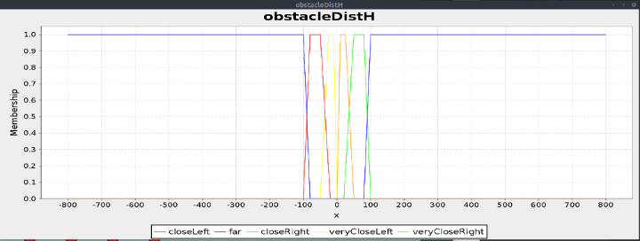
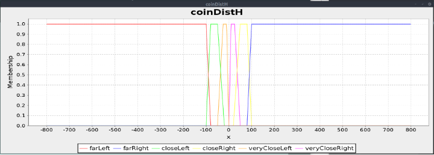
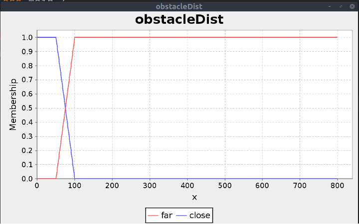
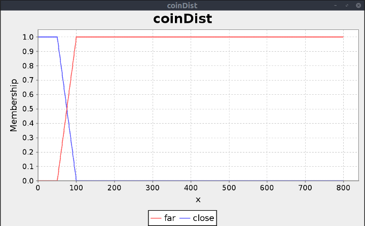
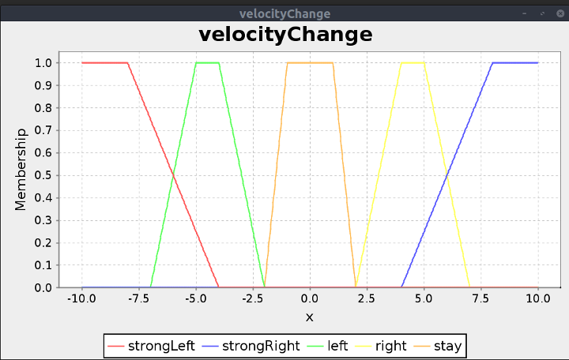
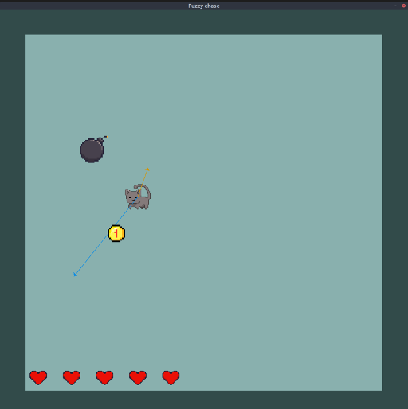

# Fuzzy Logic Driver

## Table of Contents
- [Fuzzy Logic Driver](#fuzzy-logic-driver)
  - [Table of Contents](#table-of-contents)
  - [Description](#description)
  - [Driver](#driver)
  - [Fuzzy rules and membership functions](#fuzzy-rules-and-membership-functions)
  - [Example](#example)
  - [Technologies Used](#technologies-used)
  - [Credits](#credits)

## Description

The project's goal was to implement a driver for a simulation, using Fuzzy Logic. In the simulation the player is trying to reach randomly appearing coins while avoiding obstacles on its way.

## Driver

The driver uses Fuzzy Logic to control player's movement. It takes 4 inputs, which correspond to the distances between the player and the nearest bomb or the player and the coin as well as the same distances, but on a specified axis. It outputs the velocity change, which can be also interpreted as a steering force or acceleration. The driver's output is then applied to the player's speed, which allows them to succesfully gain points and avoid collision with obstacles.

## Fuzzy rules and membership functions

* input

* output

* rules

The Fuzzy Logic rules were constructed to allow the best steering possible given just the current input. They were generated using a Python script to save some time and divide the rules logically.

## Example

* Horizontal axis:

>coinDistH: -36.8, coinDist: 85.3, obstacleDistH: -85.8, obstacleDist: 128.7 
>    velocityChange: -6.2

* Vertical axis:

>coinDistH: 77.0, coinDist: 85.3, obstacleDistH: -95.9, obstacleDist: 128.7 
>  velocityChange: 7.8

## Technologies Used
- **Java**
- jFuzzyLogic
- Swing
- Python 3

## Credits
Created by [@mhawryluk](https://www.github.com/mhawryluk), 2022.